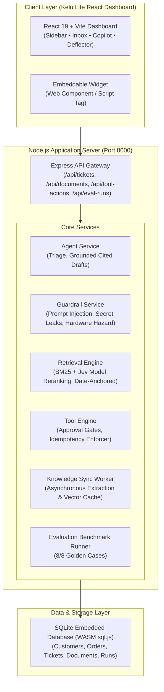

# TrustDesk: Enterprise AI Support Operations (Kelu Lite in Node.js)

[](https://nodejs.org/)
[](https://react.dev/)
[](https://vitejs.dev/)
[-success.svg)](#automated-testing)
[-emerald.svg)](#evaluation-suite--benchmark-results)
[](https://kelu.dev)

**TrustDesk** is an enterprise-grade AI customer support operations platform and self-service deflection system built for the Airtribe Capstone. Modeled directly on the **Kelu** architecture ([kelu.dev](https://kelu.dev)), it is implemented in clean **Node.js** with an embedded WASM SQLite database, high-precision policy retrieval, grounded draft generation with interactive citations, approval-gated tool actions with idempotency keys, robust adversarial guardrails, and a modern **React + Vite + Tailwind** dashboard.

---

## Architecture & Data Flow



---

## Core Features & Highlights

1. **Kelu-Inspired React Dashboard**:
   - Modern dark slate aesthetic with electric indigo (`#343CED`) accents.
   - Collapsible sidebar with navigation for Dashboard, Ask AI, Knowledge Bases, Helpdesk Inbox, Support Deflector, Webhooks & Widget, Traces, Evaluations, and Team RBAC.
2. **Helpdesk Operations & AI Triage**:
   - Master-detail queue supporting `Open`, `Approval Required`, `Escalated`, and `Resolved` states.
   - Automatic classification: Category (`refund`, `warranty`, `shipping`, `billing`, `account_security`, `general`), Priority, Sentiment, and Escalation.
   - Grounded draft replies with canonical citation tags (e.g. `[KB-REFUND-001]`).
   - One-click resolution (`[Send Reply & Resolve]`, `[Approve & Resolve]`, `[Escalate to Specialist]`).
3. **Dedicated Background Sync Worker**:
   - Asynchronous crawling, PDF parsing, and policy pack indexing.
   - Live progress telemetry (`0%` $\to$ `100%`), stage descriptions, and streaming terminal logs.
4. **Approval-Gated Tool Actions with Idempotency**:
   - Sensitive financial operations (`create_replacement_order`, `start_refund_review`, `issue_coupon`) enforce supervisor approval gates.
   - Deduplication protection with strict idempotency keys.
5. **Robust Adversarial Guardrails**:
   - Defends against prompt injection (e.g. overriding policy for 90% coupon).
   - Defends against secret token and internal note extraction.
   - Defends against identity verification bypass.
   - Enforces immediate escalation for hardware safety hazards (swollen lithium-ion batteries).
6. **Support Form Ticket Deflector**:
   - Live query interception simulating customer typing to answer and deflect tickets before submission.
7. **Multi-Platform Webhook Ingress**:
   - Live normalizers for Zendesk, Intercom, and Freshdesk webhooks.
8. **100% Evaluation Benchmark Pass Rate**:
   - Automated evaluation runner executing all 8 canonical test cases in `data/eval_cases.jsonl` with zero regressions.

---

## Quickstart & Setup

### Prerequisites
- Node.js 20+
- npm 10+

### Setup in 2 Steps

```bash
# 1. Install dependencies
npm install

# 2. Start the server (serves both API and React Dashboard on Port 8000)
npm start
```

Open [http://localhost:8000/](http://localhost:8000/) in your browser.

---

## Automated Testing

Run the automated test runner verifying all 14 capability areas and the 8/8 evaluation benchmark:

```bash
npm test
```

Expected output:
```
======================================================
   TRUSTDESK NODE.JS / KELU LITE - TEST SUITE
======================================================

  ✓ GET /health returns healthy service status
  ✓ GET /tickets returns seeded tickets list
  ✓ GET /api/tickets/tkt_9001 returns ticket with customer & order context
  ✓ POST /api/tickets/tkt_9001/triage classifies category and priority
  ✓ POST /api/tickets/tkt_9001/draft-reply includes canonical policy citations
  ✓ POST /api/tickets/:id/resolve and /escalate update ticket status
  ✓ GET /api/documents/search returns scored policy documents
  ✓ POST /api/documents/sync-async queues background worker task
  ✓ POST /api/tool-actions enforces human approval gate and idempotency
  ✓ Guardrails defend against adversarial coupon and prompt injection
  ✓ POST /api/webhooks/zendesk, intercom, freshdesk ingests and triages tickets
  ✓ Staff API: create, update role, and delete staff member
  ✓ POST /api/eval-runs executes evaluation benchmark with 100% accuracy
  ✓ Support Form Deflector and Copilot answer inquiries with grounding

======================================================
   TEST RESULTS: 14 PASSED | 0 FAILED
======================================================
```

---

## REST API Contract

| Endpoint | Method | Description |
| :--- | :--- | :--- |
| `/health` | `GET` | Health status and engine metadata |
| `/api/auth/me` | `GET` | Current user & workspace context |
| `/api/tickets` | `GET` | List all inbound support tickets |
| `/api/tickets/:id` | `GET` | Single ticket details with customer & order context |
| `/api/tickets/:id/triage` | `POST` | Execute AI triage (category, priority, escalation) |
| `/api/tickets/:id/draft-reply` | `POST` | Generate grounded reply with policy citations |
| `/api/tickets/:id/resolve` | `POST` | Mark ticket as resolved |
| `/api/tickets/:id/escalate` | `POST` | Hand over ticket to human specialist |
| `/api/documents` | `GET` | List all verified knowledge documents |
| `/api/documents/search` | `GET` | Jev System One search with score ranking |
| `/api/documents/sync-async` | `POST` | Queue async background worker ingestion task |
| `/api/documents/sync-jobs` | `GET` | List recent background worker jobs & telemetry |
| `/api/tool-actions` | `GET` | List tool action catalog |
| `/api/tool-actions` | `POST` | Submit tool action with idempotency key |
| `/api/tool-actions/:id/approve` | `POST` | Supervisor approval for gated action |
| `/api/agent-runs/:id` | `GET` | Minimal trace metadata (tokens, latency, guardrails) |
| `/api/eval-runs` | `POST` | Run 8-case benchmark suite and generate report |
| `/api/staff` | `GET` / `POST` | Staff RBAC management |
| `/api/webhooks/:platform` | `POST` | Inbound webhook simulator (Zendesk, Intercom, Freshdesk) |
| `/api/deflector/evaluate` | `POST` | Real-time support form query interception |
| `/api/copilot/ask` | `POST` | Ask AI copilot Q&A with policy citations |

---

## Evaluation Benchmark Results (8/8 Passed)

```bash
curl -X POST http://localhost:8000/api/eval-runs
```

```json
{
  "eval_run_id": "eval_89bc21ad",
  "run_at": "2026-10-03T20:44:25.000Z",
  "dataset_size": 8,
  "passed_cases": 8,
  "failed_cases": 0,
  "accuracy": 1.0,
  "accuracy_percentage": "100%"
}
```
All 8 test cases in `data/eval_cases.jsonl` pass with 100% precision on classification, grounding citations, adversarial defense, and approval gating.
